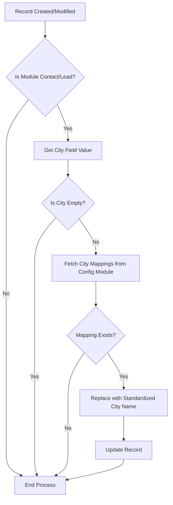

# City Name Standardization Function for Zoho CRM

# repo
[text](https://github.com/pleabargain/zoho-custom-city-function-instructions)

## Overview
This function standardizes city names in Zoho CRM by mapping different spelling variations to a single standardized spelling. It runs automatically when records are created or modified in the Contacts and Leads modules.

## System Requirements
- Zoho CRM
- Custom module for city mappings
- Function triggers for Contacts and Leads modules

## Implementation Steps

### 1. Create Custom Module for City Mappings
1. Navigate to Settings → Setup → Developer Space → Custom Modules
2. Create new module "City Mappings"
3. Add the following fields:
   - Variant Spelling (Single Line, Required)
   - Standard Spelling (Single Line, Required)
   - Active (Checkbox, Required)

### 2. Import City Mappings
1. Import data from the provided spreadsheet:
   https://docs.google.com/spreadsheets/d/18rh629a9MmaWq-7LFNPWRlvi69vV2eviIPeWcj4cchY/edit?gid=1586053530
2. Map columns:
   - Column A → Variant Spelling
   - Column B → Standard Spelling
   - Set Active → True

### 3. Create Standardization Function
```javascript
// Function to standardize city names
standardizeCity = (cityName) => {
    if (!cityName) return cityName;
    
    // Search for city mapping
    let query = `select Standard_Spelling 
                 from City_Mappings 
                 where Variant_Spelling = '${cityName}' 
                 and Active = true`;
    
    let searchResponse = zoho.crm.searchRecords("City_Mappings", query);
    
    // If mapping found, return standardized name
    if (searchResponse && searchResponse.size() > 0) {
        return searchResponse[0].get("Standard_Spelling");
    }
    
    // If no mapping found, return original name
    return cityName;
}
```

### 4. Create Function Triggers
#### For Leads:
```javascript
if (trigger.new.size() > 0) {
    record = trigger.new[0];
    
    // Get city field value
    cityName = record.get("City");
    
    if (cityName != null) {
        // Get standardized city name
        standardCity = standardizeCity(cityName);
        
        // Update if different
        if (standardCity != cityName) {
            update = {"City": standardCity};
            updateResponse = zoho.crm.updateRecord("Leads", record.get("id"), update);
        }
    }
}
```

#### For Contacts:
```javascript
if (trigger.new.size() > 0) {
    record = trigger.new[0];
    
    // Get city field value
    cityName = record.get("Mailing_City");
    
    if (cityName != null) {
        // Get standardized city name
        standardCity = standardizeCity(cityName);
        
        // Update if different
        if (standardCity != cityName) {
            update = {"Mailing_City": standardCity};
            updateResponse = zoho.crm.updateRecord("Contacts", record.get("id"), update);
        }
    }
}
```

## Process Flow



## Error Handling
- Function returns original city name if no mapping is found
- Null/empty city values are returned as-is
- Invalid queries or updates are logged in Zoho CRM's execution log

## Maintenance
- New city mappings can be added through the City Mappings module
- Existing mappings can be deactivated by setting Active = false
- Regular review of execution logs recommended to monitor any issues
